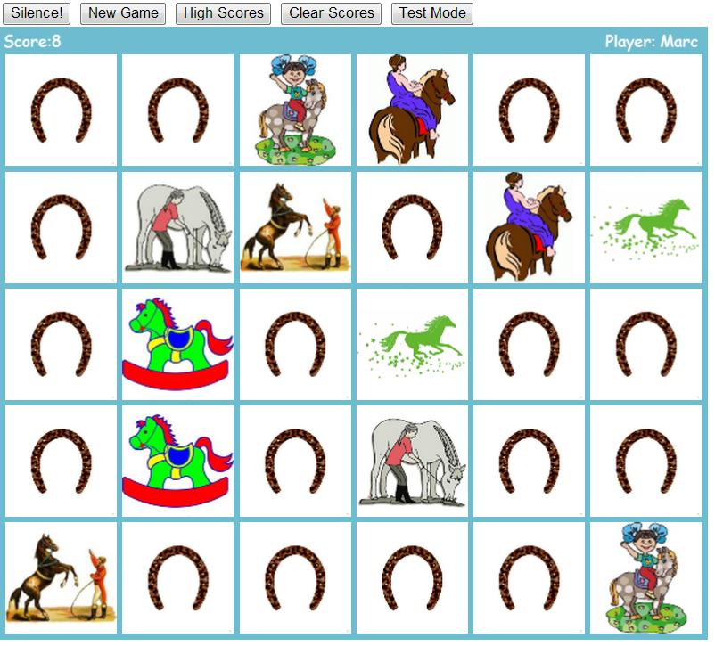

#Horsey Memory
A simple memory game with a horsey theme made with CraftyJS

#Features
* A `Flippable` component which covers up a card and allows it to be revealed
* Attempts at using singleton components (e.g. `Scoreboard`) as a kind of controller (a bit of a muddle really)
* `localStorage` for the High Score board

